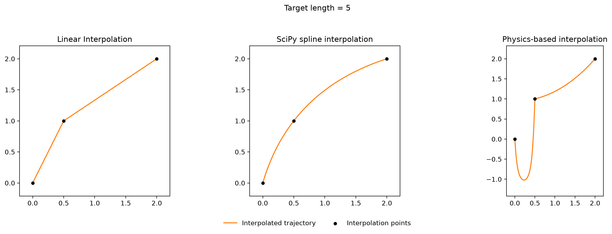
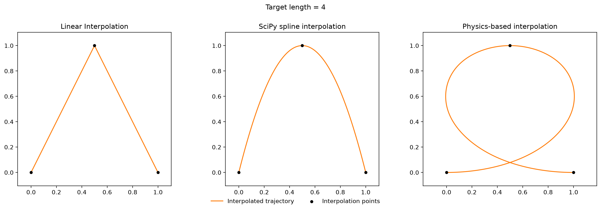
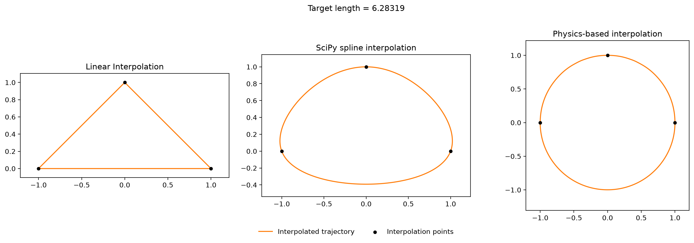
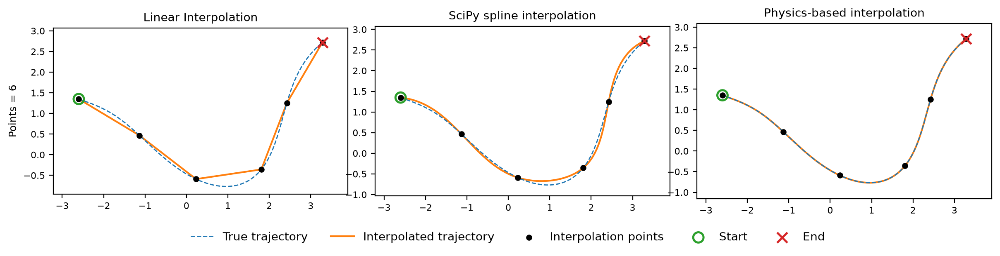
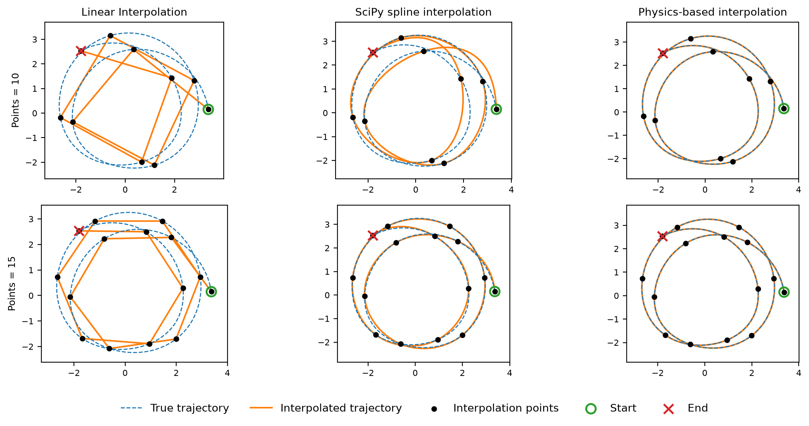
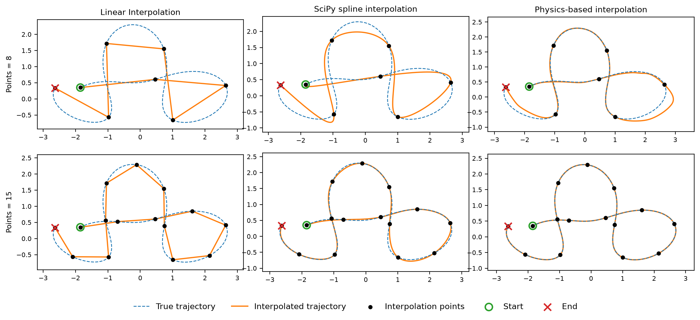
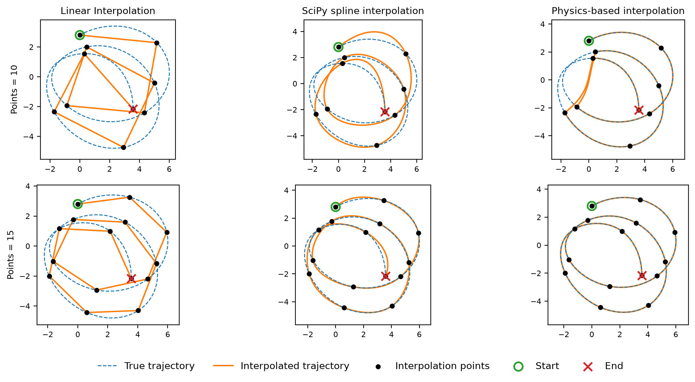
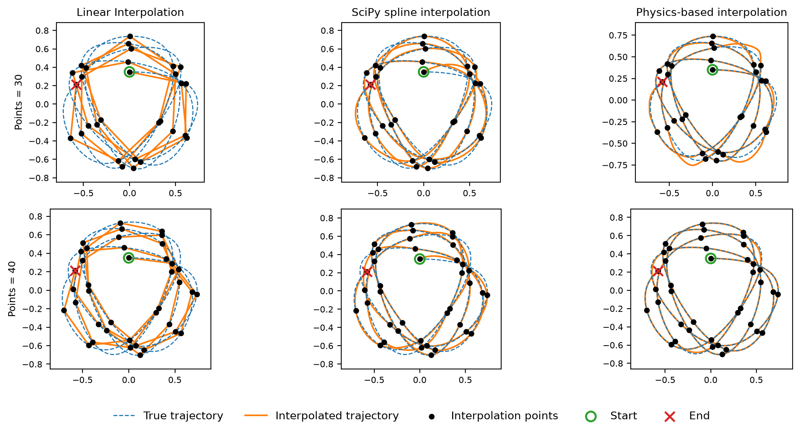

## Physics-based B-Spline Interpolator 

Physics-based B-spline Interpolator is a small Python library for interpolating sparsely sampled 2D trajectories governed by nonlinear ODEs. By incorporating a symbolic action functional for the underlying dynamics as the optimization objective, it can better recover the structure of the trajectory than purely geometric interpolation methods. When supplied, global integral constraints are enforced through an adaptive penalty scheme.

Given $N$ interpolation vertices $v_i \in \mathbb{R}^2$, the solver constructs $N-1$ cubic B-spline segments

$$
q_i(t) = (u_i(t), v_i(t)) = \sum_j c_j B_j(t), \quad t \in [0, 1]
$$

such that $q_i(1) = q_{i+1}(0) = v_i$ and $q_0(0) = v_0$, with $C^1$ continuity enforced at the junctions. 

For a symbolic Lagrangian $\mathcal{L}$, the optimized curve minimizes

$$
\sum_{\text{segments}} \int_0^1 \mathcal{L}(t, u, u', u'', v, v', v'')dt
$$

optionally subject to an integral constraint

$$
\sum_{\text{segments}} \int_0^1 \mathcal{G}(t, u, u', u'', v, v', v'')dt = g_\star.
$$

Quadrature is precomputed on the knot intervals, and symbolic derivatives are generated with SymPy. Control point optimization is handled with SciPy's L-BFGS-B optimizer inside an augmented-Lagrangian loop.

### Hanging Chain

`examples/hanging_chain.py` simulates a hanging chain of some given length anchored at the vertices.

$$
\mathcal{L}(u,v,\dot{u},\dot{v}) = v\sqrt{\dot{u}^{2}+\dot{v}^{2}}
$$



### Beam Buckling

`examples/beam_buckling.py` simulates an elastic beam of some given length buckled at the vertices with a fixed tangent. 

$$
\mathcal{L}(u,v,\ddot{u},\ddot{v}) = \frac{1}{2}\left(\ddot{u}^{2}+\ddot{v}^{2}\right)
$$



### Isoperimetric Curve

`examples/isoperimetric.py` maximizes the area enclosed by a closed curve of fixed length. 

$$
\mathcal{L}(u,v,\dot{u},\dot{v}) = -\frac{1}{2}\left(u\dot{v}-v\dot{u}\right)
$$



### Polynomial Channel Scattering

`examples/polynomial_channel.py` reconstructs a trajectory scattering through a curved polynomial channel.

$$
\mathcal{L}_{\mathrm{JM}} = \sqrt{2\left(E-V_{\mathrm{PC}}(u,v)\right)}\sqrt{\dot{u}^{2}+\dot{v}^{2}},
\qquad
V_{\mathrm{PC}}(u,v) = \frac{\kappa}{2}\left(v-\alpha u^2\right)^2+\mu u
$$



### Kepler Trajectory 1

`examples/kepler_1.py` reconstructs a generated trajectory moving through a three-center gravitational potential.

$$
\mathcal{L}_{\mathrm{JM}} = \sqrt{2\left(E-V_K(u,v)\right)}\sqrt{\dot{u}^{2}+\dot{v}^{2}},
\qquad
V_K(u,v) = -G\sum_i\frac{m_i}{\sqrt{(u-a_i)^2+(v-b_i)^2}}
$$



### Kepler Trajectory 2

`examples/kepler_2.py` compares sparse-sample reconstructions for a second three-center gravitational system.

$$
\mathcal{L}_{\mathrm{JM}} = \sqrt{2\left(E-V_K(u,v)\right)}\sqrt{\dot{u}^{2}+\dot{v}^{2}},
\qquad
V_K(u,v) = -G\sum_i\frac{m_i}{\sqrt{(u-a_i)^2+(v-b_i)^2}}
$$



### Kepler Trajectory 3

`examples/kepler_3.py` reconstructs a generated trajectory in a two-center gravitational potential.

$$
\mathcal{L}_{\mathrm{JM}} = \sqrt{2\left(E-V_K(u,v)\right)}\sqrt{\dot{u}^{2}+\dot{v}^{2}},
\qquad
V_K(u,v) = -G\sum_i\frac{m_i}{\sqrt{(u-a_i)^2+(v-b_i)^2}}
$$



### Henon-Heiles Trajectory

`examples/henon_heiles.py` reconstructs nonlinear motion generated by the Henon-Heiles potential.

$$
\mathcal{L}_{\mathrm{JM}} = \sqrt{2\left(E-V_{\mathrm{HH}}(u,v)\right)}\sqrt{\dot{u}^{2}+\dot{v}^{2}},
\qquad
V_{\mathrm{HH}}(u,v) = \frac{1}{2}\left(u^2+v^2\right)
+\lambda\left(u^2v-\frac{v^3}{3}\right)
$$




## Reproducibility

Create an environment, install the package in editable mode, and run the tests:

```bash
python -m venv .venv
source .venv/bin/activate
pip install -e .
python -m unittest
```

Run an example from the repository root:

```bash
python examples/hanging_chain.py
python examples/kepler_1.py
python examples/henon_heiles.py
```

The examples save Matplotlib figures to `figures/` and open Matplotlib windows. On headless systems, configure a non-interactive backend before running plotting code.

## Status

This is research-oriented code and still work in progress.
